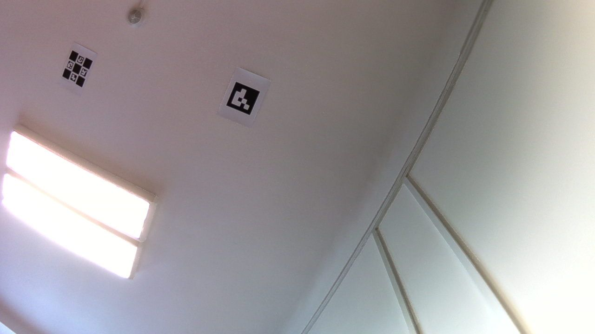

<p align="center">
  
</p>

# ArUco Vision GPS

**Vision-based GPS emulator for indoor drones using ceiling-mounted ArUco markers**

A minimal Python system (~490 lines) for Raspberry Pi Zero 2W that detects ArUco markers on the ceiling, calculates world-frame position, and sends `VISION_POSITION_ESTIMATE` to an ArduCopter flight controller via MAVLink. The FC handles all navigation, PID control, missions, and failsafes natively.


*Live camera view from RPi Zero 2W - ArUco marker ID 0 on ceiling at ~1.7m distance*

## Current Performance (RPi Zero 2W)

| Metric | Value |
|--------|-------|
| Resolution | 1280x720 (MJPG) |
| Detection Rate | 99-100% |
| Processing Time | ~140ms/frame |
| FPS | ~6 |
| Marker Type | Single ArUco (DICT_4X4_50) |
| Marker Size | 18cm (A4 printable) |
| Working Distance | 1.5-2.5m |
| Source Code | ~490 lines (2 files) |

### Timing Breakdown
```
gray:3ms  CLAHE:20ms  bgr:2ms  detect:110ms  total:135ms
```

### Sample JSON Output (HTTP stream mode)
```json
{
  "x": 0.549, "y": -0.289, "z": 1.712,
  "yaw": 159.2, "marker_ids": ["0"], "confidence": 1.0,
  "detection_rate": 1.0, "uptime": 10.4,
  "timing": {"gray": "5", "clahe": "21", "detect": "107", "total": "134"}
}
```

## Architecture

```
Ceiling Markers ──► USB Camera ──► RPi Zero 2W ──► Flight Controller
                    (MJPG 720p)    vision_gps.py    ArduCopter EKF
                                   - CLAHE preprocess
                                   - ArUco detection
                                   - Position estimation
                                   - ENU->NED convert
                                   mavlink_bridge.py
                                   - VISION_POSITION_ESTIMATE
```

## Hardware Requirements

- **Drone**: ArduCopter-compatible flight controller (Pixhawk, etc.)
- **Companion Computer**: Raspberry Pi Zero 2W
- **Camera**: USB camera (facing upward toward ceiling), MJPG capable
- **Markers**: Printed ArUco markers (18cm, DICT_4X4_50) on A4 paper
- **Connection**: UART serial between RPi and flight controller

## Quick Start

### 1. Setup
```bash
git clone https://github.com/asdfgh0318/aruco_drone_nav.git
cd aruco_drone_nav
pip install -r requirements.txt

# Generate and print ArUco markers (18cm for A4)
python3 tools/generate_markers.py --ids 0,1,2,3 --size 180 -o markers/
```

### 2. Deploy to RPi
```bash
./sync_to_rpi.sh
ssh aruconav@aruconav.local
cd /home/aruconav/aruco_drone_nav
```

### 3. Run
```bash
# Test mode - prints position to console
python3 -m src --mode test

# Stream mode - HTTP server for remote monitoring
python3 -m src --mode stream --port 8001

# Run mode - sends position to flight controller via MAVLink
python3 -m src --mode run
```

### 4. Monitor (from local machine)
```bash
# Check position via HTTP
curl http://aruconav.local:8001/position

# Debug viewer with live frames
python3 tools/debug_viewer.py --host aruconav.local --port 8001
```

## 3D Mission Viewer

Browser-based tool for visualizing GLB building models with flight paths and ArduPilot missions.

```bash
# Open directly (static, no server needed)
xdg-open tools/glb_viewer.html

# Or with convert support (JSON↔waypoints, tlog→JSON)
python3 server.py
```

Load **GLB** models, **JSON** VR planner missions, and **.waypoints** ArduPilot files. Drag & drop supported. Sample files included in `viewer/samples/`.

An interactive tutorial (`?` button or `?` key) walks through all features on first visit.

## Project Structure

```
aruco_drone_nav/
+-- src/                        # Core system (~490 lines)
|   +-- vision_gps.py           # Camera, detection, position, HTTP server, main loop
|   +-- mavlink_bridge.py       # MAVLink: connect, send position, set EKF origin
|   +-- __main__.py             # Entry point (python3 -m src)
+-- config/
|   +-- system_config.yaml      # Camera, ArUco, control settings
|   +-- camera_params.yaml      # Calibrated camera intrinsics
|   +-- marker_map.yaml         # Marker world positions (ENU)
+-- tools/                      # Development & debug tools
|   +-- glb_viewer.html         # 3D mission viewer (standalone HTML)
+-- viewer/samples/             # Sample mission files for viewer testing
+-- docs/                       # Documentation + images
+-- markers/                    # Generated marker PDFs
```

## Detection Pipeline

1. **Frame Capture** - Threaded USB camera capture (MJPG 720p, buffer=1)
2. **CLAHE** - Adaptive histogram equalization (clipLimit=2.5, 8x8 tiles)
3. **ArUco Detection** - `detectMarkers()` with tuned params for ceiling distance
4. **Pose Estimation** - `solvePnP()` per marker for 6-DOF pose
5. **Position Calculation** - Camera → Body → World frame transform
6. **MAVLink Output** - `VISION_POSITION_ESTIMATE` with covariance

## FC Configuration (ArduCopter)

```
AHRS_EKF_TYPE = 3      # Use EKF3
EK3_SRC1_POSXY = 6     # ExternalNav for XY position
EK3_SRC1_POSZ = 1      # Baro for altitude (safer indoors)
EK3_SRC1_YAW = 6       # ExternalNav for yaw
VISO_TYPE = 1           # MAVLink vision
GPS_TYPE = 0            # Disable GPS (indoor)
COMPASS_ENABLE = 0      # Disable compass (indoor)
```

See [docs/FC_CONFIG.md](docs/FC_CONFIG.md) for full parameter list and tuning guide.

## HTTP API (Stream Mode)

| Endpoint | Response |
|----------|----------|
| `GET /position` | JSON with x, y, z, yaw, confidence, timing, detection_rate |
| `GET /debug-frame` | JPEG image from camera |

## Documentation

- **[WIRING.md](docs/WIRING.md)** - RPi + SpeedyBee F405 V3 wiring guide
- **[FC_CONFIG.md](docs/FC_CONFIG.md)** - Flight controller configuration
- **[TECHNICAL.md](docs/TECHNICAL.md)** - Algorithms, coordinate frames, timing
- **[TESTING.md](docs/TESTING.md)** - Testing procedures
- **[CURRENT_PLAN.md](CURRENT_PLAN.md)** - Project status and roadmap

## Known Issues

- **OpenCV CORNER_REFINE_CONTOUR crash**: Rare assertion error, handled by skipping bad frames
- **Single-threaded detection**: ArUco detect takes ~110ms, limiting FPS to ~6

## License

Proprietary - Warsaw University of Technology

## Authors

- Adam Koszalka
- Claude Code (AI Assistant)

---

*Last updated: 2026-02-23*
