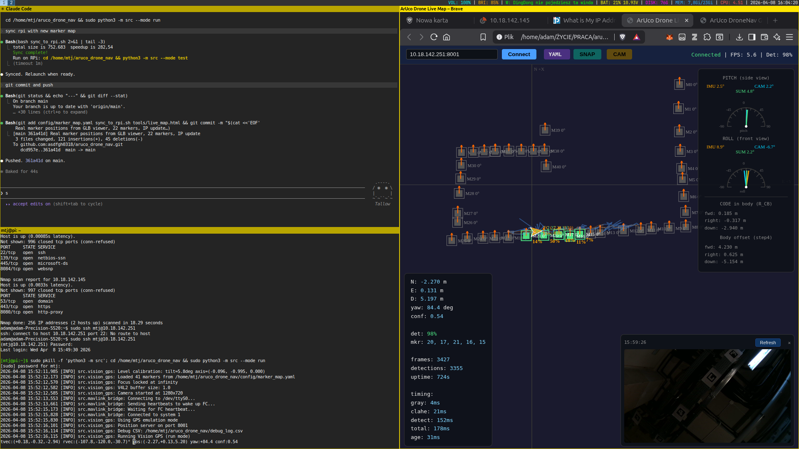
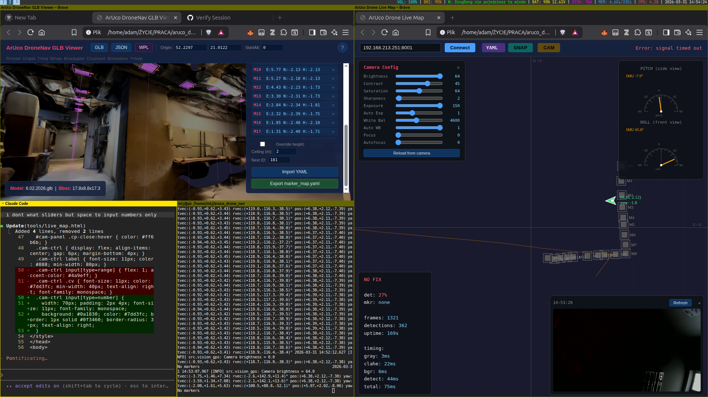
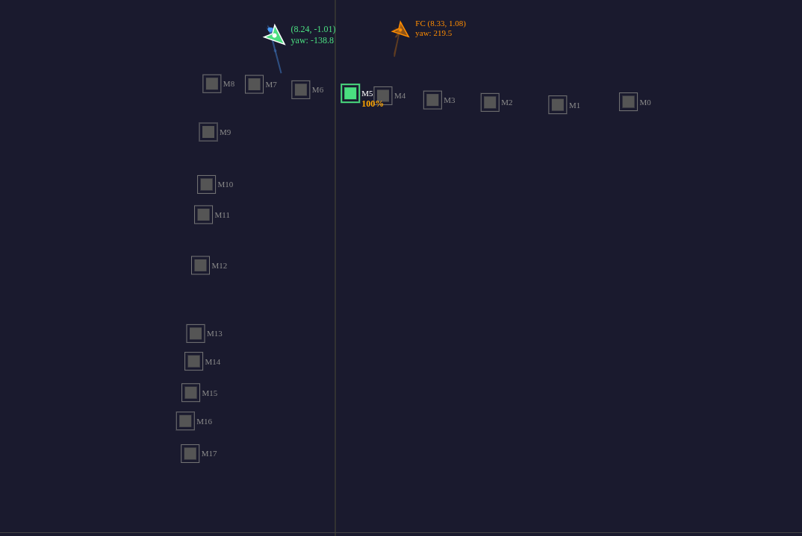
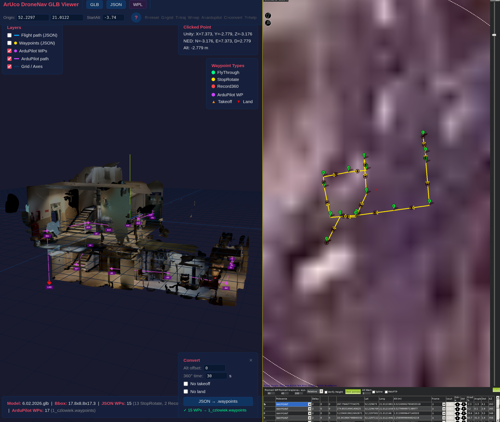

<p align="center">
  
</p>

# ArUco Vision GPS

**Vision-based GPS emulator for indoor drones using ceiling-mounted ArUco markers**

A minimal Python system (~920 lines) for Raspberry Pi Zero 2W that detects ArUco markers on the ceiling, calculates world-frame position via angle-based IMU-corrected estimation, and sends `GPS_INPUT` to an ArduCopter flight controller via MAVLink2. The FC handles all navigation, PID control, missions, and failsafes natively — barometer handles altitude, vision handles XY position and yaw.


*Live map showing drone position (green), FC telemetry (orange), and detected ceiling markers during corridor traversal*

## Performance (RPi Zero 2W)

| Metric | Value |
|--------|-------|
| Resolution | 1280x720 (MJPG) |
| Detection Rate | 90-100% |
| Processing Time | ~50-90ms/frame |
| FPS | ~11-20 |
| Markers | 47 deployed (DICT_4X4_50, 20cm, ceiling-mounted) |
| Working Distance | 1.5-5m |
| Source Code | ~920 lines (2 files) |

```
gray:4ms  clahe:30ms  detect:47ms  total:~80ms  age:20ms
```

### Sample JSON Output
```json
{
  "n": 0.549, "e": -0.289, "d": 1.712,
  "yaw": 159.2, "marker_ids": ["0", "1"], "confidence": 0.85,
  "marker_weights": {"0": 0.62, "1": 0.38},
  "detection_rate": 1.0, "uptime": 10.4,
  "timing": {"gray": "4", "clahe": "30", "detect": "47", "total": "81", "age": "20"}
}
```

## Architecture

```
Ceiling Markers ──► USB Camera ──► RPi Zero 2W ──► Flight Controller
                    (MJPG 720p)    vision_gps.py    ArduCopter EKF
                                   - CLAHE preprocess
                                   - ArUco detection (grayscale)
                                   - solvePnPGeneric (IPPE disambig)
                                   - Angle-based + IMU position
                                   - Multi-marker weighted fusion
                                   mavlink_bridge.py
                                   - GPS_INPUT (MAVLink2)
                                   - Dynamic horiz_accuracy
```

## Hardware

- **Drone**: SpeedyBee F405 V3 (custom firmware with `AP_GPS_MAV_ENABLED=1`)
- **Companion Computer**: Raspberry Pi Zero 2W, NixOS arm64
- **Camera**: USB camera (upward-facing), MJPG 1280×720, focus locked at infinity
- **Markers**: 20cm ArUco (DICT_4X4_50) on A4 paper, ceiling-mounted
- **Connection**: UART serial at 115200 baud

## Quick Start

```bash
git clone https://github.com/asdfgh0318/aruco_drone_nav.git
cd aruco_drone_nav
pip install -r requirements.txt

# Generate markers
python3 tools/generate_markers.py --ids 0-19 --size 200 -o markers/

# Deploy to RPi
./sync_to_rpi.sh

# Run on RPi
sudo python3 -m src --mode run     # Flight mode
sudo python3 -m src --mode test    # Console debug
```

## Tools

| Tool | Purpose |
|------|---------|
| `tools/live_map.html` | Browser 2D live map with marker weights, FC arrow, YAML import, camera config |
| `tools/glb_viewer.html` | Browser 3D viewer for building models + flight paths + marker placement |
| `tools/debug_viewer.py` | Remote frame capture with timing overlay |
| `tools/vr_to_waypoints.py` | VR planner JSON → ArduPilot `.waypoints` |
| `tools/generate_markers.py` | Generate printable ArUco marker PDFs |
| `tools/calibrate_camera.py` | Interactive chessboard camera calibration |
| `tools/calibrate_level.py` | Camera tilt calibration |

## FC Parameters

```
GPS_TYPE = 14           # MAVLink GPS
EK3_SRC1_POSXY = 3      # GPS for XY
EK3_SRC1_POSZ = 1       # Baro for Z
SERIAL4_BAUD = 115       # 115200
```

## HTTP API (port 8001)

| Endpoint | Response |
|----------|----------|
| `GET /position` | JSON: position, yaw, markers, confidence, timing, IMU |
| `GET /markers` | JSON: marker map from YAML |
| `GET /debug-frame` | JPEG: latest camera frame |
| `GET /camera-config` | JSON: camera controls |
| `POST /camera-config` | Update camera settings live |

## Documentation

**[docs/site.html](docs/site.html)** — Comprehensive documentation site (open in browser)

See also: [CLAUDE.md](CLAUDE.md) for architecture details, [docs/GLB_VIEWER.md](docs/GLB_VIEWER.md) for 3D viewer guide.

## Gallery

| | |
|---|---|
|  |  |
| *Full development workspace* | *Vision (green) vs FC (orange) position* |
|  |  |
| *3D building model with markers and flight path* | *Camera view of ceiling markers* |

<!-- TODO: Add flight video, hover test results -->

## License

Proprietary - Warsaw University of Technology

## Authors

- Adam Koszalka
- Claude Code (AI Assistant)

---

*Last updated: 2026-04-13*
